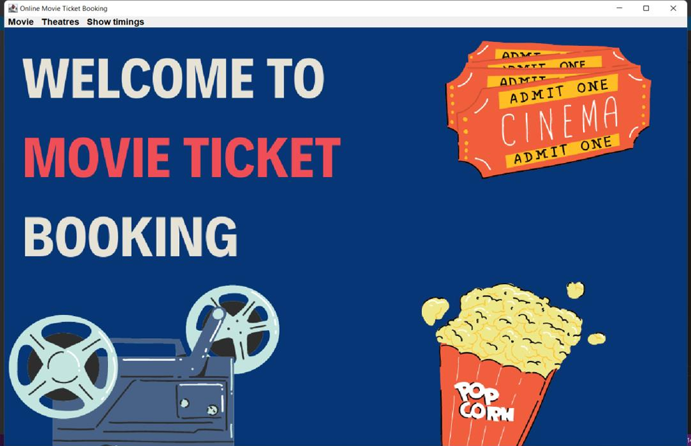
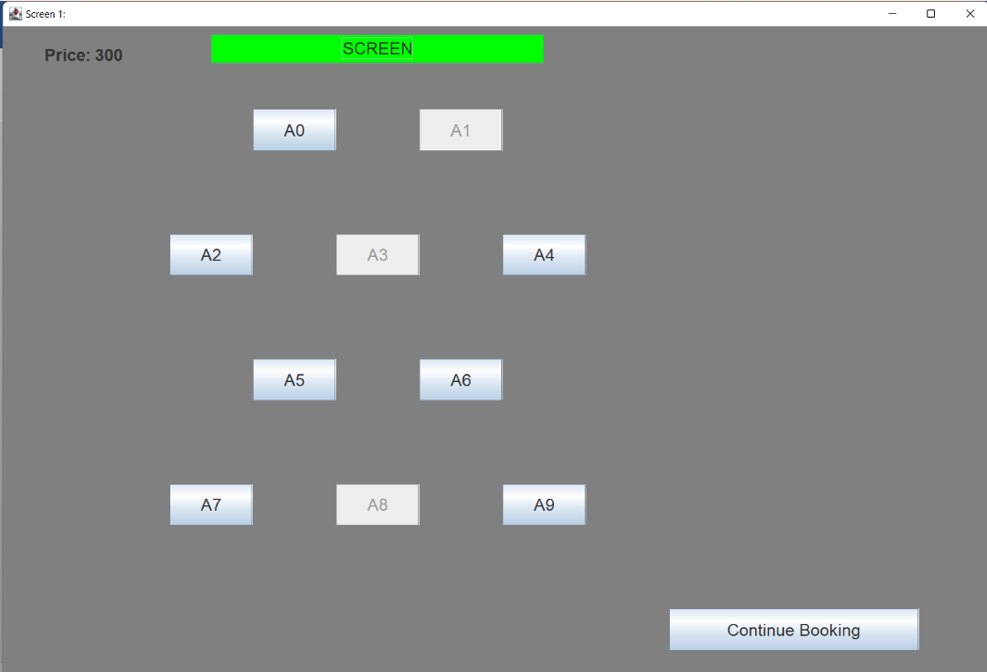
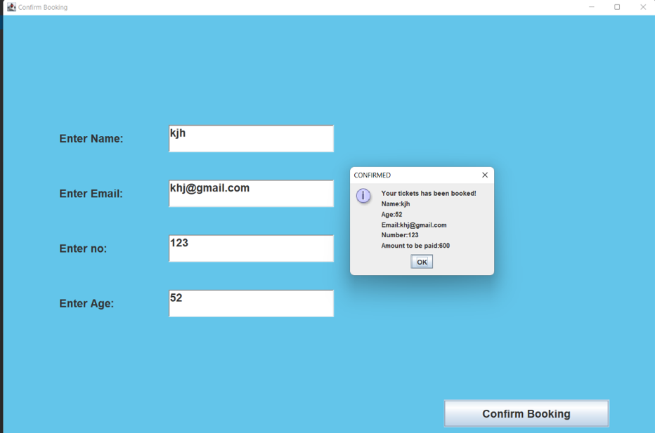

# java-movie-ticket-booking-system

Java Swing desktop application for browsing cinemas, movies, and showtimes, selecting available seats, and confirming ticket bookings.

## Technologies

- Java
- Java Swing and AWT
- Object-oriented programming
- Event-driven programming with `ActionListener`
- Apache POI
- Microsoft Excel workbook for seat data

## Features

- Browse the available cinemas
- Browse movies and view movie details
- Select a showtime
- View and select seats for different screens
- Disable seats already stored as booked
- Calculate the booking amount according to the selected seats and screen price
- Validate customer name, age, phone number, and email fields
- Display a booking-confirmation summary with customer details and total amount
- Store selected seat identifiers in an Excel workbook

## User Flow

1. Open the application from the welcome screen.
2. Browse by movie or cinema.
3. Select a movie and showtime.
4. Choose from the available seats.
5. Continue to the customer-details screen.
6. Enter the required booking information.
7. Confirm the booking and review the amount to be paid.

## How It Works

The application is organized into separate Java classes for the welcome screen, cinema and movie lists, movie details, showtimes, seating screens, and booking confirmation. A central `MyActionListener` handles navigation and user actions across these frames.

Seat identifiers are read from `TicketInfoData.xlsx` using Apache POI. Seats found in the workbook are disabled in the interface so that they cannot be selected again. Newly selected seats are written back to the appropriate worksheet. The application calculates the total from the number of selected seats and the price assigned to that booking path.

## Development Process

1. Defined the booking flow and required information with the project clients.
2. Created initial frames for cinemas, movies, showtimes, seats, and customer details.
3. Incorporated feedback to include movie length and other movie information.
4. Connected the frames through Java event listeners.
5. Implemented seat selection and used an Excel workbook to retain booked-seat identifiers.
6. Added input checks and a booking-confirmation summary.

## Running the Project

### Requirements

- Java Development Kit
- Apache POI dependencies compatible with the source code
- The original image assets used by the Swing frames
- `TicketInfoData.xlsx`

The original documentation references these Apache POI-era JARs:

- `commons-collections4-4.1.jar`
- `poi-3.17.jar`
- `poi-ooxml-3.17.jar`
- `poi-ooxml-schemas-3.17.jar`
- `xmlbeans-2.6.0.jar`

### Steps

1. Clone the repository.
2. Open it in a Java IDE.
3. Add the required Apache POI JARs to the project classpath.
4. Confirm that the `IMG` assets and `TicketInfoData.xlsx` paths match the paths used in the source.
5. Run `MovieTicket.WelcomeFrame`.

## What We Learned

- How to divide a desktop application into multiple classes and frames
- How to use Swing and AWT to build an interactive GUI
- How to coordinate navigation through event listeners
- How to validate form input and provide user feedback through dialog boxes
- How to read and write Excel data with Apache POI
- How to translate client feedback into application changes

## Possible Improvements

- Replace the Excel workbook with a relational database
- Use a layout manager instead of fixed component coordinates
- Introduce model, view, and controller separation
- Add unique booking IDs and a structured booking history
- Add stronger email, phone-number, and age validation
- Prevent partial writes if a booking is cancelled before confirmation
- Add automated tests for seat availability, pricing, and input validation
- Manage dependencies with Maven or Gradle
- Update the movie and showtime data so it is not hard-coded in the interface
- Implement confirmation email only after adding and testing a mail service

## Screenshots

## Contributors

- Mansiba Gohil
- Deep Bhalsod
